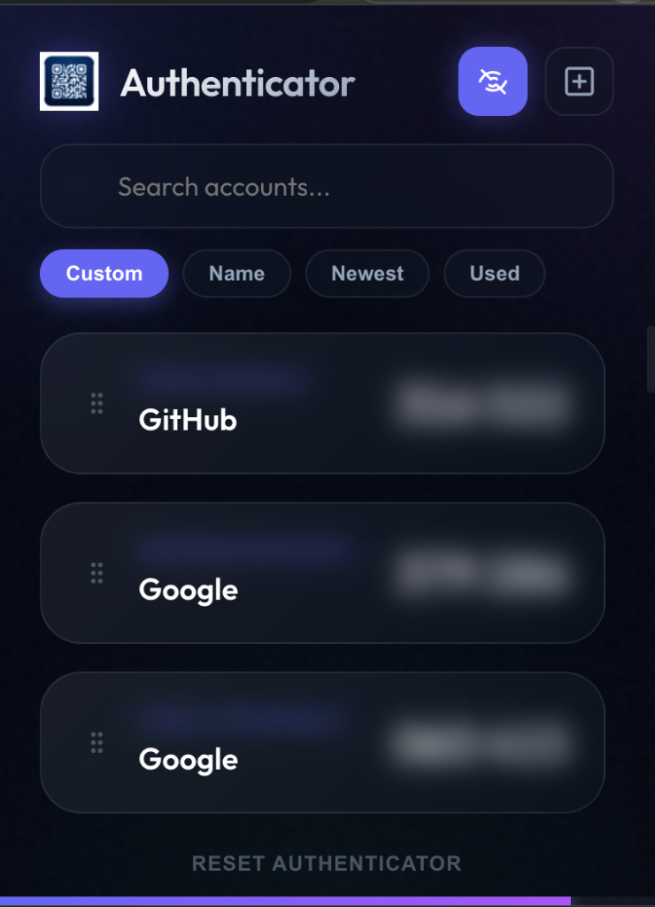

# Authenticator

A premium, secure, and beautiful Chrome extension for managing your two-factor authentication (2FA) codes. Built with a focus on privacy and high-end user experience.

## Features

- **Elite UI**: Modern glassmorphism design with mesh gradients and smooth micro-interactions.
- **Privacy Mode**: One-click masking of sensitive emails and codes for secure use in public.
- **Advanced QR Scanning**: Robust detection engine capable of reading high-density QR codes from images and screenshots (up to 2500px).
- **Drag-and-Drop Reordering**: Intuitively organize your accounts exactly how you want them.
- **Smart Sorting**: 
  - **Custom**: Your manual reorder.
  - **Name**: Alphabetical sorting by issuer.
  - **Newest**: Recently added accounts first.
  - **Used**: Puts your most frequently/recently copied codes at the top.
- **Secure Local Storage**: All secrets are stored locally in your browser using `chrome.storage.local`. No data ever leaves your device.
- **Google Authenticator Support**: Supports importing Google Authenticator migration QR codes.
- **Fast Search**: Instant filtering for large account lists.

## Installation

1. Download or clone this repository.
2. Open Chrome and navigate to `chrome://extensions/`.
3. Enable **Developer mode** in the top right corner.
4. Click **Load unpacked** and select the extension folder.

## Usage

- **Add Account**: Click the `+` icon in the header to upload or drop a QR code image.
- **Copy Code**: Click anywhere on an account card to copy the current 6-digit code.
- **Privacy**: Click the Eye icon to mask/unmask your data.
- **Reorder**: Use the drag handle on the left of any card to move it.
- **Remove**: Hover over a card and click the `X` in the top right to remove an individual account.
- **Reset**: Use the "Reset Authenticator" action in the footer to clear all data.

## Security

This extension is built to be private by design. It requires no external network access and stores all sensitive authentication secrets encrypted within the browser's local storage.
