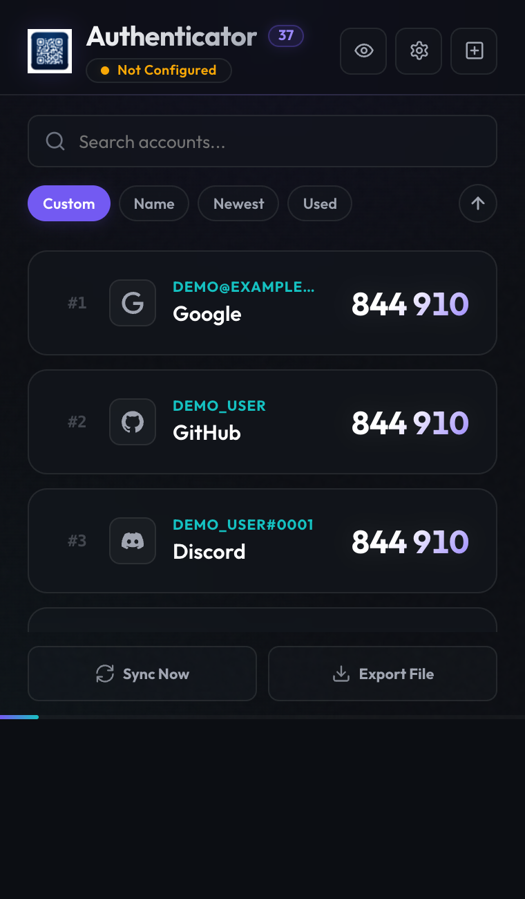
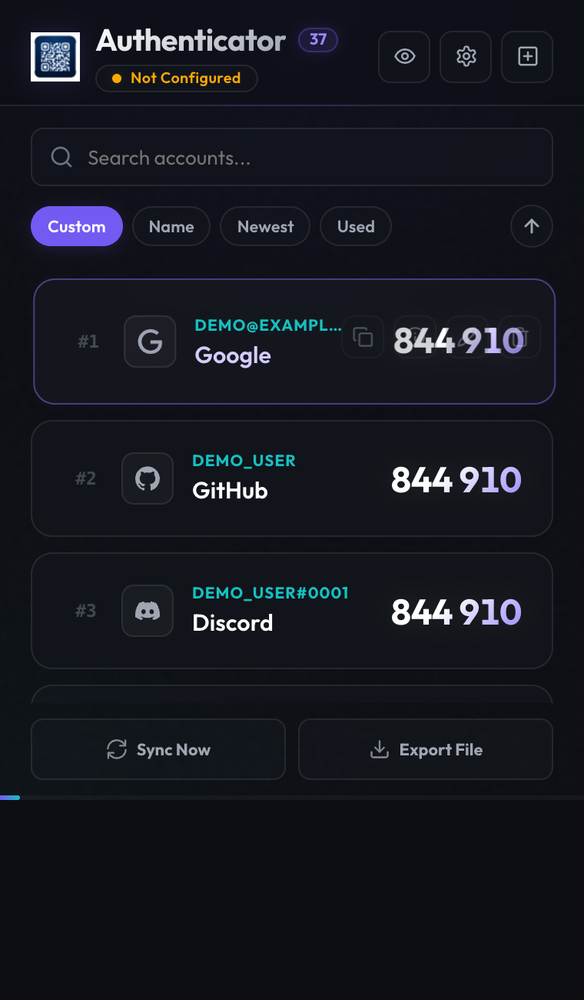
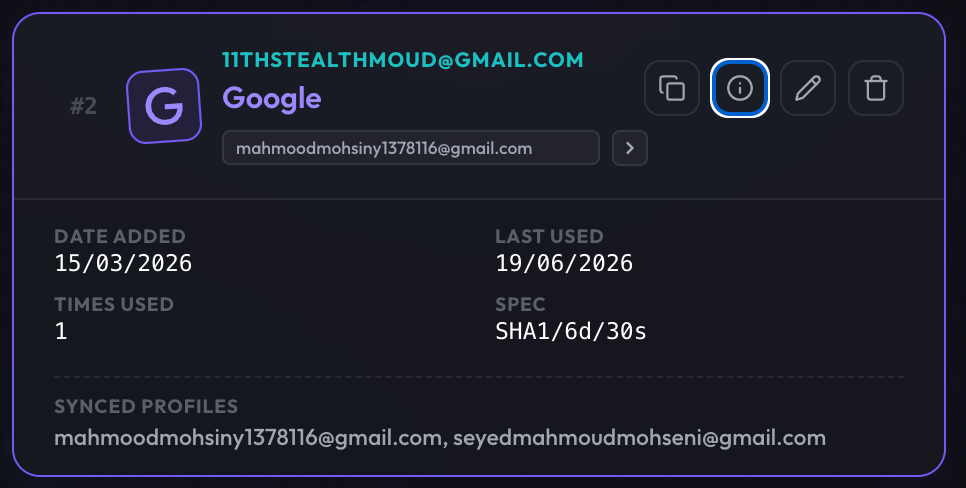
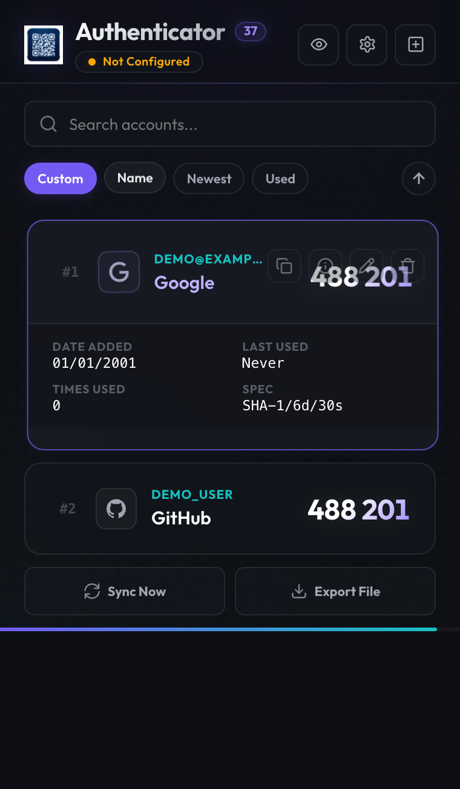
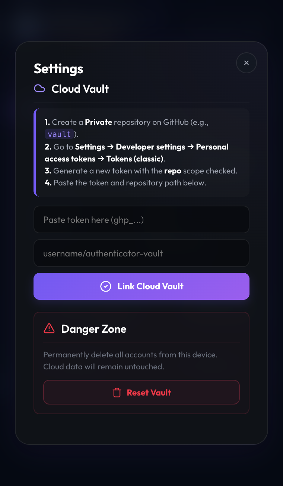
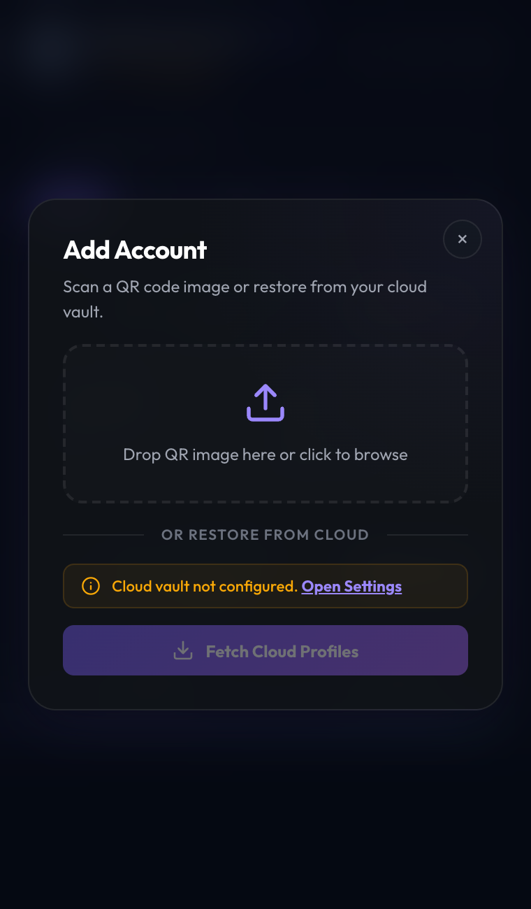

# Authenticator

A premium, secure, and beautiful Chrome extension for managing two-factor authentication (2FA) codes. Designed with glassmorphism aesthetics, responsive micro-animations, and direct GitHub-backed synchronization to keep your secrets private and in your control.

## Screenshots

### Main Vault View

### Hover States & Quick Actions

### Expanded Details Drawer

### Hover Alignment in Details Mode

### Dedicated Settings Panel

### Import & Restore Center

## Core Features

- **Premium Glassmorphism Design**: Rich translucent cards featuring backdrop blur filters, harmonized accents, and responsive layout scaling.
- **Privacy Masking**: One-click toggling (eye icon) to mask sensitive account labels, issuer names, and current 2FA codes when presenting or using the extension in public spaces.
- **Dynamic Search & Filtering**: Instant fuzzy search across issuers and account labels.
- **Smart Sorting Configurations**:
  - **Custom Order**: Sort accounts by their original addition order (supports reversing with a single click).
  - **Alphabetical (Name)**: Sort alphabetically by issuer name and label.
  - **Newest First**: Order accounts by addition date.
  - **Frequency (Used)**: Auto-prioritize based on usage frequency.
  - **Direction Toggle**: Instantly flip sorting direction (ascending/descending) with live visual feedback.
- **Robust Local Storage**: All secret keys and configuration are stored locally in the browser sandbox via `chrome.storage.local`.

## Advanced Features & UX Highlights

### 1. Sequential Indexing

Each account card is prefixed with a sequential index number (e.g., `#1`, `#2`, `#3`). This provides instant reference points for tracking how many accounts you have and how they are ordered when scrolling through your vault.

### 2. Contextual Metadata Drawer

Clicking the Info (`i`) action button expands the card to reveal deep metadata for auditing:

- **Date Added**: Real historical timestamp (retrieved and backfilled directly from your vault's Git commit history).
- **Last Used**: Accurate tracking of when the OTP code was last copied.
- **Times Used**: Cumulative counter showing access frequency.
- **Spec**: Full visibility of the TOTP specification (e.g., `SHA1/6d/30s`).

### 3. Chrome Profile Identification & Access Auditing

Prevent cross-profile leakage. The expanded card lists all browser profiles actively syncing that specific credential under **Synced Profiles** (e.g., `work@example.com`, `personal@example.com`).

### 4. Interactive Click-to-Copy Triggers

To prevent accidental clipboard overwrites when clicking around cards, click-to-copy is scoped specifically to:

- The sequential index number.
- The actual 2FA code element.
- The dedicated copy action icon.
Interactive elements feature hover glow effects and tactile scale-down active animations.

### 5. Fluid Layout Adaptability

On hover, the card height expands cleanly, action buttons fade/slide in at the top-right, and the active 2FA code slides down to the bottom-right. The layout prevents content squishing, and long labels/issuers are truncated with an ellipsis on a single line to avoid layout breaks. When the details drawer is open, hover height expands to `204px`, shifting the divider line down so the sliding code never overlaps borders.

## Cloud Vault Synchronization

Rather than relying on third-party servers, Authenticator syncs directly with a private GitHub repository under your control:

- **Zero Intermediary Servers**: The extension talks directly to the GitHub API via client-side requests.
- **Merge Conflict Resolution**: Synchronizing performs a pull-and-merge of remote changes with local storage, ensuring updates from other Chrome profiles are safely combined.
- **Isolated Target Files**: Separate profiles write to profile-isolated files in the vault repository, preventing data leakage.

### Setup Instructions

1. **Create Repository**: Create a private GitHub repository (e.g., `authenticator-vault`).
2. **Generate Token**: Generate a Personal Access Token (classic) on GitHub with the `repo` scope.
3. **Configure Settings**: Open the extension, click the gear icon (Settings) in the top-right, and enter:
   - **GitHub Personal Access Token**
   - **Repository Path** (format: `username/repository-name`)
4. **Link Vault**: Click **Link Cloud Vault**. The badge in the header will update to show the connection status, and background synchronization will automatically handle backups.

## Local Backups

If you prefer offline backups:

- **Export**: Click **Export File** to save your decrypted vault as a JSON file.
- **Import**: Click **Sync Now / Import** and drag-and-drop or select your backup file to restore your accounts instantly.

## Developer & Installation

1. Clone or download this repository.
2. Open Chrome and navigate to `chrome://extensions/`.
3. Enable **Developer mode** (top-right toggle).
4. Click **Load unpacked** and select the root directory of this extension.
